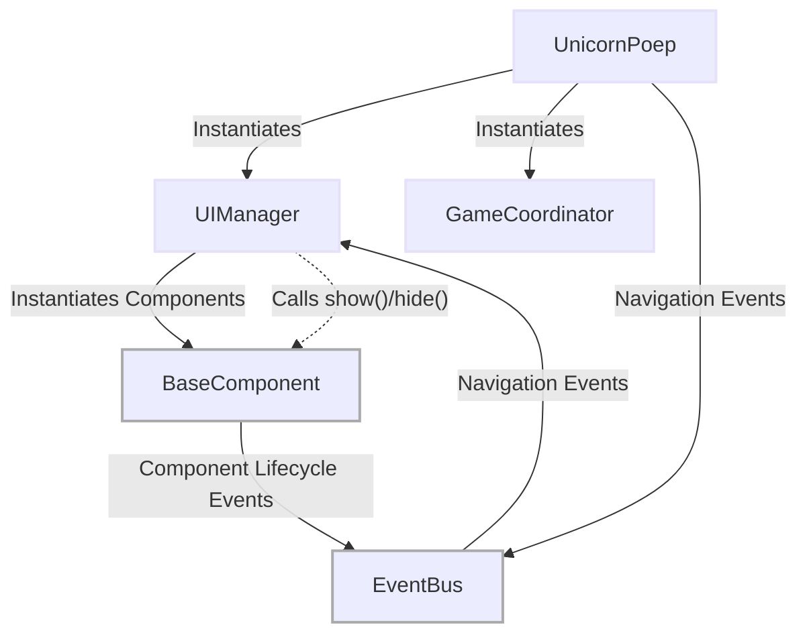
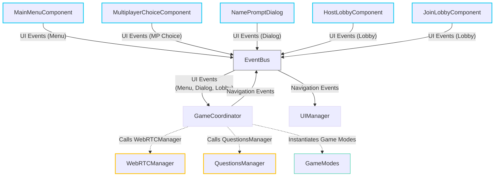
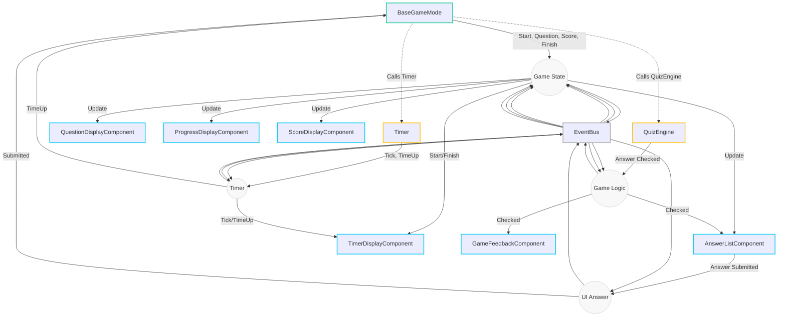
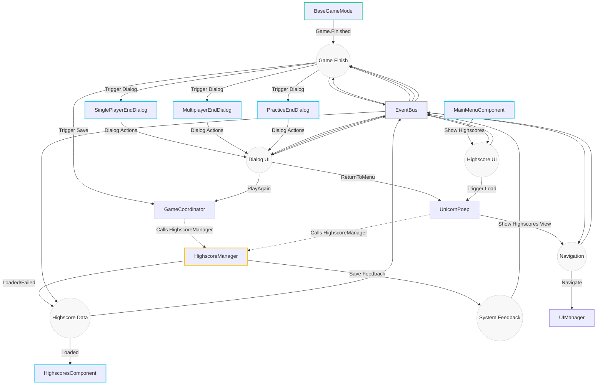
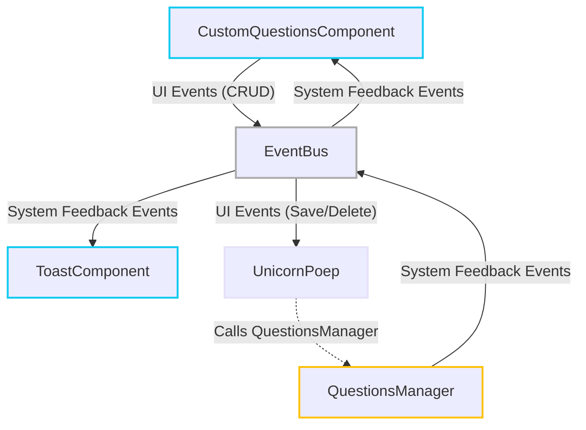

# V2 Application Event Flow (Segmented)

This file breaks down the event flow of the V2 application into logical segments using Mermaid diagrams. GitHub Flavored Markdown can render this syntax directly.

Node border colors indicate the component category:
*   **Coordinators / Managers:** Light Purple (`#e6e0f8`)
*   **Core / Base:** Grey (`#aaaaaa`)
*   **Services:** Amber/Orange (`#ffc107`)
*   **Game Modes:** Teal (`#20c997`)
*   **UI Components:** Light Blue (`#0dcaf0`)

Arrows indicate event flow via the central EventBus or direct calls (dashed lines).
Labels on arrows to/from EventBus are simplified categories.

## 1. System Initialization & Navigation

This diagram shows the initial application setup and how view navigation is handled.

## 2. Game Startup Flow (Menus & Coordination)

This diagram shows how user interactions in the menus trigger the game coordination process to start different game modes.

## 3. Core Gameplay Loop (Single Player / Practice / Base)

Focuses on the flow of questions, answers, scoring, and timing. Small nodes near the EventBus represent event categories.

## 4. Multiplayer Communication & Sync

Illustrates the primary WebRTC message flows and state synchronization between Host, Client, and UI during multiplayer.

```mermaid
graph TD
    %% Node Styles
    style WebRTCManager stroke:#ffc107,stroke-width:2px
    style MultiplayerClientManager stroke:#ffc107,stroke-width:2px
    style MultiplayerGame stroke:#20c997,stroke-width:2px
    style HostLobbyComponent stroke:#0dcaf0,stroke-width:2px
    style JoinLobbyComponent stroke:#0dcaf0,stroke-width:2px
    style PlayerListComponent stroke:#0dcaf0,stroke-width:2px
    style AnswerListComponent stroke:#0dcaf0,stroke-width:2px
    style EventBus stroke:#aaaaaa,stroke-width:2px

    %% Core MP Components
    WebRTCManager
    MultiplayerGame("MP Game (Host)")
    MultiplayerClientManager("MP Client Mgr")
    EventBus

    %% Relevant UI
    HostLobbyComponent
    JoinLobbyComponent
    PlayerListComponent
    AnswerListComponent

    %% WebRTC -> EventBus (Raw Events)
    WebRTCManager -- "Connection/Msg/Error Events" --> EventBus

    %% EventBus -> Host Logic
    EventBus -- "Client Msgs / Disconnects" --> MultiplayerGame

    %% Host Logic -> EventBus (Syncing State to Clients)
    MultiplayerGame -- "Player/Game State Updates" --> EventBus
    MultiplayerGame -. "Calls WebRTC (Send)" .-> WebRTCManager

    %% EventBus -> Client Logic
    EventBus -- "Host Msgs / Disconnects" --> MultiplayerClientManager
    EventBus -- "Game State Sync from Host" --> MultiplayerClientManager

    %% Client UI -> EventBus (Player Actions)
    AnswerListComponent -- "Player Answer Submitted" --> EventBus

    %% EventBus -> Client Logic (Processing UI Actions)
    EventBus -- "Player Answer Submitted" --> MultiplayerClientManager

    %% Client Logic -> EventBus (Updating Local State / Sending to Host)
    MultiplayerClientManager -- "Processed State Updates" --> EventBus
    MultiplayerClientManager -. "Calls WebRTC (Send)" .-> WebRTCManager

    %% EventBus -> UI Updates
    EventBus -- "Connection Status / Errors" --> HostLobbyComponent
    EventBus -- "Connection Status / Errors" --> JoinLobbyComponent
    EventBus -- "Player List / Game State" --> HostLobbyComponent
    EventBus -- "Player List / Game State" --> JoinLobbyComponent
    EventBus -- "Player List / Game State" --> PlayerListComponent
```

## 5. Game End & Highscores Flow

Shows game completion, end dialogs, and highscore handling. Small nodes near the EventBus represent event categories.

## 6. Custom Questions Management

Details the flow for creating, updating, and deleting custom question sheets.

