# Application Event Flow Scenarios

This document visualizes key processes within the application by mapping out specific user scenarios. Each scenario details the sequence of events and direct interactions between different components (UI elements, coordinators, services, etc.).

Components that actively emit or handle events within a scenario are shown using a record shape, clearly listing the specific event interactions (Emits, Handles). Direct method calls between components are shown as dashed arrows.

Each diagram is presented in two toggleable versions:
1.  **With EventBus:** Shows events flowing through a conceptual EventBus node.
2.  **Direct Event View:** Hides the EventBus node and shows direct arrows from the event emitter to the handler(s), labeled with the event name.

These diagrams illustrate the flow of events and actions for specific user scenarios within the application. Components actively emitting or handling events are shown as records detailing those event interactions. Toggle between views showing the EventBus explicitly or showing direct component interactions.

## 1. Scenario: Application Startup

Shows the initial steps when the application is launched, including instantiation of core managers and display of the first UI view.

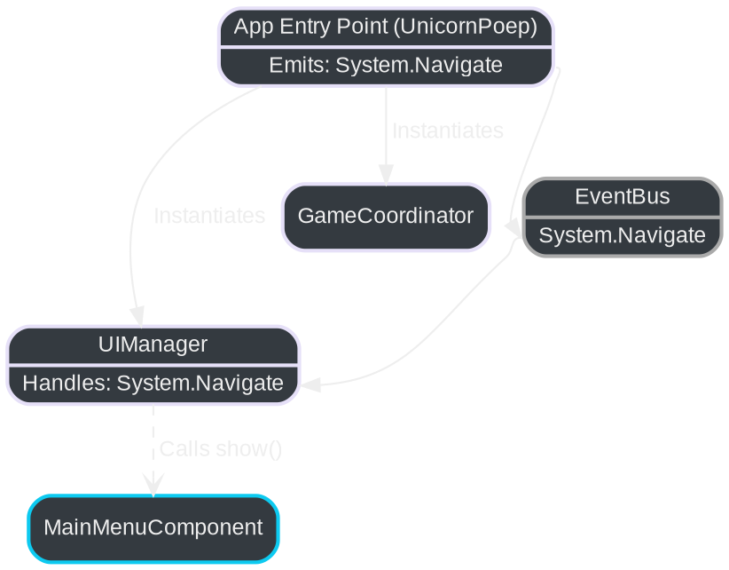

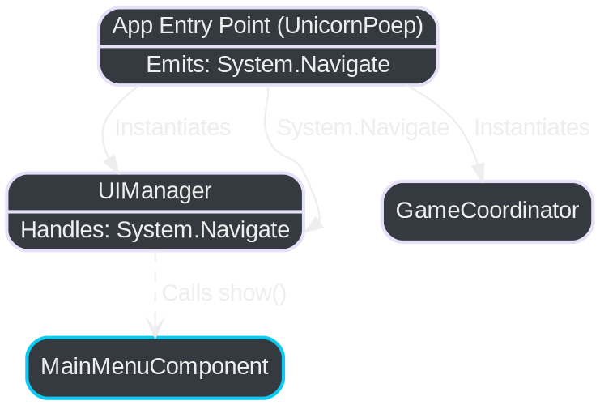

## 2. Scenario: Starting a Single Player Game

Illustrates the flow from the main menu to starting a single-player game instance.

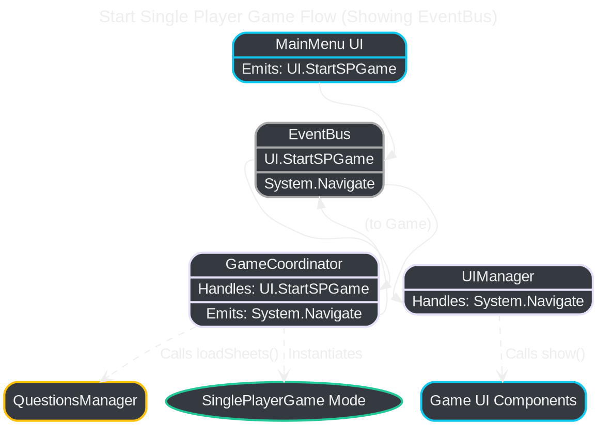

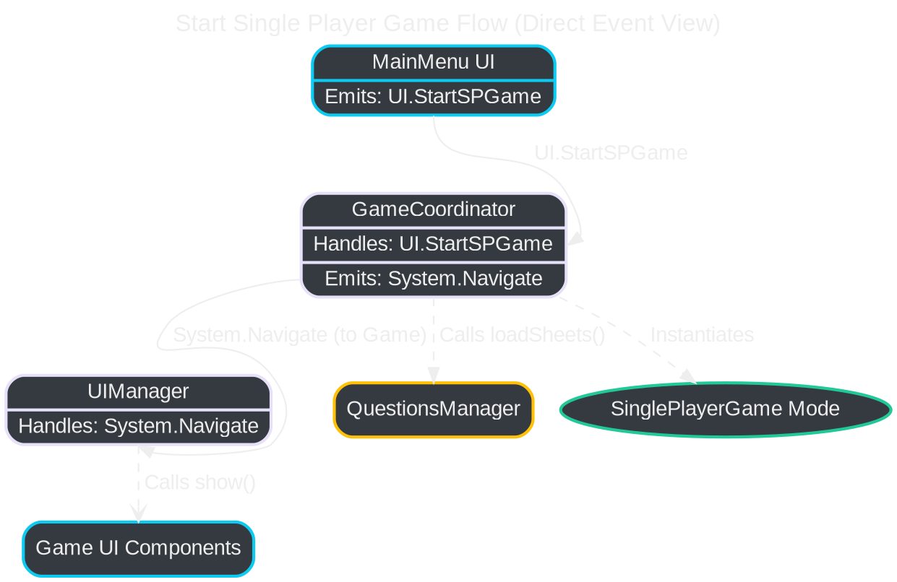

## 3. Scenario: Game Startup Flow (Menus & Coordination)

Illustrates initial UI interactions leading to game setup actions, showing specific events emitted by each UI component.

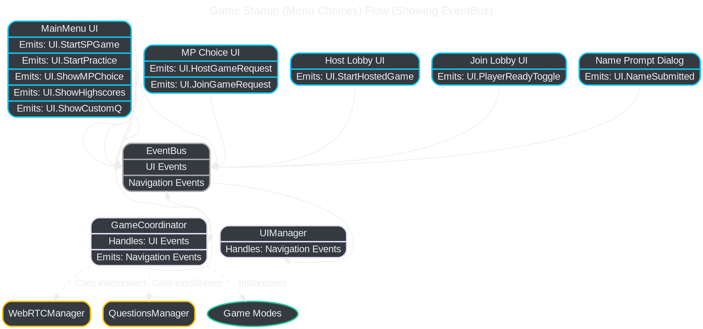

```dot
// VERSION: Without EventBus
digraph GameStartup_Direct {
    rankdir=TD;
    sep="0.6";
    overlap=false;
    bgcolor="transparent";
    fontname="Arial";
    node [shape=box, style="rounded,filled", fontcolor="#eeeeee", color="#eeeeee", fontname="Arial"];
    edge [fontcolor="#eeeeee", color="#eeeeee", fontname="Arial"];
    graph [label="Game Startup (Menu Choices) Flow (Direct Event View)", labelloc=t, fontsize=16, fontcolor="#eeeeee"];

    // Node Styles (Dark fill, specific border remains)
    MainMenuComponent [shape="record", fillcolor="#343a40", color="#0dcaf0", penwidth=2,
                       label="{ MainMenu UI | {<emits_sp> Emits: UI.StartSPGame} | {<emits_pr> Emits: UI.StartPractice} | {<emits_mp> Emits: UI.ShowMPChoice} | {<emits_hs> Emits: UI.ShowHighscores} | {<emits_cq> Emits: UI.ShowCustomQ} }"];
    MultiplayerChoiceComponent [shape="record", fillcolor="#343a40", color="#0dcaf0", penwidth=2,
                                label="{ MP Choice UI | {<emits_host> Emits: UI.HostGameRequest} | {<emits_join> Emits: UI.JoinGameRequest} }"];
    HostLobbyComponent [shape="record", fillcolor="#343a40", color="#0dcaf0", penwidth=2,
                        label="{ Host Lobby UI | {<emits_start> Emits: UI.StartHostedGame} }"]; // Example
    JoinLobbyComponent [shape="record", fillcolor="#343a40", color="#0dcaf0", penwidth=2,
                        label="{ Join Lobby UI | {<emits_ready> Emits: UI.PlayerReadyToggle} }"]; // Example
    NamePromptDialog [shape="record", fillcolor="#343a40", color="#0dcaf0", penwidth=2,
                      label="{ Name Prompt Dialog | {<emits_name> Emits: UI.NameSubmitted} }"];
    GameCoordinator [shape="record", fillcolor="#343a40", color="#e6e0f8", penwidth=2,
                     label="{ GameCoordinator | {<handles_ui> Handles: UI Events} | {<emits_nav> Emits: Navigation Events} }"]; // Handles the grouped UI Event
    UIManager [shape="record", fillcolor="#343a40", color="#e6e0f8", penwidth=2,
               label="{ UIManager | {<handles_nav> Handles: Navigation Events} }"];
    WebRTCManager [shape="record", fillcolor="#343a40", color="#ffc107", penwidth=2,
                   label="{ WebRTCManager | {<emits_init> Emits: WebRTC.HostInitialized} | {<emits_conn> Emits: WebRTC.ConnectedToHost} | {<emits_fail> Emits: WebRTC.ConnectionFailed} | {<emits_cli_conn> Emits: WebRTC.ClientConnected} | {<emits_cli_dis> Emits: WebRTC.ClientDisconnected} }"]; // Specific emits
    MultiplayerGame [shape="record", fillcolor="#343a40", color="#20c997", penwidth=2,
                     label="{ MP Game (Host Logic) | {<handles_rtc> Handles: WebRTC.ClientConnected/Disconnected} | {<emits_state> Emits: MP.PlayerListUpdated} }"]; // Specific handles/emits
    MultiplayerClientManager [shape="record", fillcolor="#343a40", color="#ffc107", penwidth=2,
                              label="{ MP Client Mgr | {<handles_rtc> Handles: WebRTC.ConnectedToHost/Failed} | {<emits_state> Emits: MP.PlayerListUpdated (indirect)} }"]; // Specific handles/emits

    // EventBus: Specific events or useful groups for lobby flow
    EventBus [shape="record", fillcolor="#343a40", color="#aaaaaa", penwidth=2,
              label="{ EventBus | {<evUIHost> UI.HostGameRequest} | {<evUIJoin> UI.JoinGameRequest} | {<evUIStart> UI.StartHostedGame} | {<evWebRTC> WebRTC Status/Msg} | {<evPlayerListUpdate> MP.PlayerListUpdated} | {<evNav> System.Navigate} }"]; // Renamed evMPState to evPlayerListUpdate

    // 1. User Chooses Host/Join (Specific Events)
    MultiplayerChoiceComponent:emits_host -> EventBus:evUIHost; MultiplayerChoiceComponent:emits_join -> EventBus:evUIJoin;
    EventBus:evUIHost -> GameCoordinator:handles_choice; EventBus:evUIJoin -> GameCoordinator:handles_choice;

    // 2. Coordinator Initiates Connection (Direct Call + Event)
    GameCoordinator -> WebRTCManager [label=" Calls initHost / connectToHost", style=dashed];
    GameCoordinator:emits_nav -> EventBus:evNav [label=" (to Lobby View)"];
    EventBus:evNav -> UIManager:handles_nav;
    UIManager -> HostLobbyComponent [label=" Calls show()", style=dashed]; UIManager -> JoinLobbyComponent [label=" Calls show()", style=dashed];

    // 3. WebRTC Reports Status (Specific Events -> Grouped Port)
    WebRTCManager:emits_init -> EventBus:evWebRTC [label=" (Host Initialized)"];
    WebRTCManager:emits_conn -> EventBus:evWebRTC [label=" (Connected To Host)"];
    WebRTCManager:emits_fail -> EventBus:evWebRTC [label=" (Connection Failed)"];
    EventBus:evWebRTC -> HostLobbyComponent:handles_rtc [label=" (Display Host ID / Status)"];
    EventBus:evWebRTC -> JoinLobbyComponent:handles_rtc [label=" (Display Connection Status)"];
    EventBus:evWebRTC -> MultiplayerClientManager:handles_rtc [label=""]; // Client manager needs connected/failed status

    // 4. Client Connects / Disconnects (Specific Events -> Grouped Port)
    WebRTCManager:emits_cli_conn -> EventBus:evWebRTC [label=" (Client Connected)"];
    WebRTCManager:emits_cli_dis -> EventBus:evWebRTC [label=" (Client Disconnected)"];
    WebRTCManager:emits_player_update -> EventBus:evPlayerListUpdate [label=" (Internal player list update)"]; // Target renamed port

    // 5. Host/Client Manager Notified (Handles Grouped Event)
    EventBus:evWebRTC -> MultiplayerGame:handles_rtc [label=""]; // Host needs connect/disconnect
    // Client manager already handled its connect/fail status in step 3

    // 6. Host/Client Managers Update Player State (Specific Event)
    // MultiplayerGame:emits_state -> EventBus:evPlayerListUpdate [label=""]; // Host logic no longer emits this directly for UI update
    // MultiplayerClientManager:emits_state -> EventBus:evPlayerListUpdate [label=" (from Host)"]; // Client relays state from host

    // 7. UI Updates Player List (Handles Specific Event)
    EventBus:evPlayerListUpdate -> HostLobbyComponent:handles_state [label=""]; // Source renamed port
    EventBus:evPlayerListUpdate -> JoinLobbyComponent:handles_state [label=""]; // Source renamed port
    EventBus:evPlayerListUpdate -> PlayerListComponent:handles_state [label=""]; // Source renamed port

    // 8. Host Starts Game (Specific Event)
    HostLobbyComponent:emits_start -> EventBus:evUIStart [label=""];
    EventBus:evUIStart -> GameCoordinator:handles_lobby [label=""];
}
```

## 4. Scenario: Core Gameplay Loop (Single Player / Practice / Base)

Illustrates the typical event flow during a non-multiplayer game round, showing specific events emitted.

```dot
// VERSION: With EventBus
digraph GameplayLoop_WithBus {
    rankdir=TD;
    sep="0.6";
    overlap=false;
    bgcolor="transparent";
    fontname="Arial";
    node [shape=box, style="rounded,filled", fontcolor="#eeeeee", color="#eeeeee", fontname="Arial"];
    edge [fontcolor="#eeeeee", color="#eeeeee", fontname="Arial"];
    graph [label="Core Gameplay Loop (SP/Practice) (Showing EventBus)", labelloc=t, fontsize=16, fontcolor="#eeeeee"];

    // Node Styles (Dark fill, specific border remains)
    BaseGameMode [shape="record", fillcolor="#343a40", color="#20c997", penwidth=2,
                  label="{ BaseGameMode | {<emits_qready> Emits: Game.QuestionReady} | {<emits_score> Emits: Game.ScoreUpdated} | {<emits_finish> Emits: Game.Finished} | {<handles_ui> Handles: UI.AnswerSubmitted} | {<handles_timer> Handles: Game.TimeUp} }"]; // Specific emits
    QuizEngine [shape="record", fillcolor="#343a40", color="#ffc107", penwidth=2,
                label="{ QuizEngine | {<emits_logic> Emits: Game.AnswerChecked} }"]; // Specific emit
    Timer [shape="record", fillcolor="#343a40", color="#ffc107", penwidth=2,
           label="{ Timer | {<emits_tick> Emits: Game.TimerTick} | {<emits_timeup> Emits: Game.TimeUp} }"]; // Specific emits
    QuestionDisplayComponent [shape="record", fillcolor="#343a40", color="#0dcaf0", penwidth=2,
                              label="{ QuestionDisplay | {<handles_state> Handles: Game State Events} }"]; // Handles grouped event
    AnswerListComponent [shape="record", fillcolor="#343a40", color="#0dcaf0", penwidth=2,
                         label="{ AnswerList | {<handles_state> Handles: Game State Events} | {<emits_ui> Emits: UI.AnswerSubmitted} | {<handles_logic> Handles: Game.AnswerChecked} }"]; // Handles grouped state
    ProgressDisplayComponent [shape="record", fillcolor="#343a40", color="#0dcaf0", penwidth=2,
                              label="{ ProgressDisplay | {<handles_state> Handles: Game State Events} }"]; // Handles grouped event
    ScoreDisplayComponent [shape="record", fillcolor="#343a40", color="#0dcaf0", penwidth=2,
                         label="{ ScoreDisplay | {<handles_state> Handles: Game State Events} | {<handles_score> Handles: Game.ScoreUpdated} }"]; // Handles grouped state, maybe specific score?
    TimerDisplayComponent [shape="record", fillcolor="#343a40", color="#0dcaf0", penwidth=2,
                           label="{ TimerDisplay | {<handles_state> Handles: Game State Events} | {<handles_timer> Handles: Game.TimerTick} }"]; // Handles grouped state, specific tick
    GameFeedbackComponent [shape="record", fillcolor="#343a40", color="#0dcaf0", penwidth=2,
                           label="{ GameFeedback | {<handles_logic> Handles: Game.AnswerChecked} }"];

    // EventBus: Grouped events for gameplay
    EventBus [shape="record", fillcolor="#343a40", color="#aaaaaa", penwidth=2,
              label="{ EventBus | {<evState> Game State Events} | {<evUI> UI.AnswerSubmitted} | {<evLogic> Game.AnswerChecked} | {<evTimer> Timer Events} }"]; // Uses specific event names in ports

    // 1. Game Flow Events -> Port evState (Specific Events feeding Grouped Port)
    BaseGameMode:emits_qready -> EventBus:evState; BaseGameMode:emits_score -> EventBus:evState; BaseGameMode:emits_finish -> EventBus:evState;
    // Port evState -> Listeners (Handles Grouped Event)
    EventBus:evState -> QuestionDisplayComponent:handles_state; EventBus:evState -> AnswerListComponent:handles_state; EventBus:evState -> ProgressDisplayComponent:handles_state; EventBus:evState -> ScoreDisplayComponent:handles_state; EventBus:evState -> TimerDisplayComponent:handles_state;
    // Specific Score Update Handling (Alternative/Addition)
    // BaseGameMode:emits_score -> EventBus:evScore; EventBus:evScore -> ScoreDisplayComponent:handles_score;

    // 2. User Interaction -> Port evUI (Specific Event)
    AnswerListComponent:emits_ui -> EventBus:evUI;
    // Port evUI -> Listener (Handles Specific Event)
    EventBus:evUI -> BaseGameMode:handles_ui;

    // 3. Answer Processing -> Port evLogic (Direct Call + Specific Event)
    BaseGameMode -> QuizEngine [label=" Calls checkAnswer", style=dashed];
    QuizEngine:emits_logic -> EventBus:evLogic;
    // Port evLogic -> Listeners (Handles Specific Event)
    EventBus:evLogic -> GameFeedbackComponent:handles_logic [label=" (Shows Feedback)"];
    EventBus:evLogic -> AnswerListComponent:handles_logic [label=" (Highlights Answer)"];

    // 4. Timer -> Port evTimer (Direct Call + Specific Events feeding Grouped Port)
    BaseGameMode -> Timer [label=" Calls start/stop", style=dashed];
    Timer:emits_tick -> EventBus:evTimer; Timer:emits_timeup -> EventBus:evTimer;
    // Port evTimer -> Listeners (Handles Grouped/Specific Events)
    EventBus:evTimer -> TimerDisplayComponent:handles_timer [label=" (Tick)"];
    EventBus:evTimer -> BaseGameMode:handles_timer [label=" (TimeUp)"];
}
```

```dot
// VERSION: Without EventBus
digraph GameplayLoop_Direct {
    rankdir=TD;
    sep="0.6";
    overlap=false;
    bgcolor="transparent";
    fontname="Arial";
    node [shape=box, style="rounded,filled", fontcolor="#eeeeee", color="#eeeeee", fontname="Arial"];
    edge [fontcolor="#eeeeee", color="#eeeeee", fontname="Arial"];
    graph [label="Core Gameplay Loop (SP/Practice) (Direct Event View)", labelloc=t, fontsize=16, fontcolor="#eeeeee"];

    // Node Styles (Dark fill, specific border remains)
    BaseGameMode [shape="record", fillcolor="#343a40", color="#20c997", penwidth=2,
                  label="{ BaseGameMode | {<emits_qready> Emits: Game.QuestionReady} | {<emits_score> Emits: Game.ScoreUpdated} | {<emits_finish> Emits: Game.Finished} | {<handles_ui> Handles: UI.AnswerSubmitted} | {<handles_timer> Handles: Game.TimeUp} }"];
    QuizEngine [shape="record", fillcolor="#343a40", color="#ffc107", penwidth=2,
                label="{ QuizEngine | {<emits_logic> Emits: Game.AnswerChecked} }"];
    Timer [shape="record", fillcolor="#343a40", color="#ffc107", penwidth=2,
           label="{ Timer | {<emits_tick> Emits: Game.TimerTick} | {<emits_timeup> Emits: Game.TimeUp} }"];
    QuestionDisplayComponent [shape="record", fillcolor="#343a40", color="#0dcaf0", penwidth=2,
                              label="{ QuestionDisplay | {<handles_state> Handles: Game State Events} }"];
    AnswerListComponent [shape="record", fillcolor="#343a40", color="#0dcaf0", penwidth=2,
                         label="{ AnswerList | {<handles_state> Handles: Game State Events} | {<emits_ui> Emits: UI.AnswerSubmitted} | {<handles_logic> Handles: Game.AnswerChecked} }"];
    ProgressDisplayComponent [shape="record", fillcolor="#343a40", color="#0dcaf0", penwidth=2,
                              label="{ ProgressDisplay | {<handles_state> Handles: Game State Events} }"];
    ScoreDisplayComponent [shape="record", fillcolor="#343a40", color="#0dcaf0", penwidth=2,
                         label="{ ScoreDisplay | {<handles_state> Handles: Game State Events} | {<handles_score> Handles: Game.ScoreUpdated} }"];
    TimerDisplayComponent [shape="record", fillcolor="#343a40", color="#0dcaf0", penwidth=2,
                           label="{ TimerDisplay | {<handles_state> Handles: Game State Events} | {<handles_timer> Handles: Game.TimerTick} }"];
    GameFeedbackComponent [shape="record", fillcolor="#343a40", color="#0dcaf0", penwidth=2,
                           label="{ GameFeedback | {<handles_logic> Handles: Game.AnswerChecked} }"];

    // 1. Game Flow Events -> Listeners (Direct Event Flows)
    BaseGameMode:emits_qready -> QuestionDisplayComponent:handles_state [label=" Game State Event"];
    BaseGameMode:emits_qready -> AnswerListComponent:handles_state [label=" Game State Event"];
    BaseGameMode:emits_qready -> ProgressDisplayComponent:handles_state [label=" Game State Event"];
    BaseGameMode:emits_qready -> ScoreDisplayComponent:handles_state [label=" Game State Event"];
    BaseGameMode:emits_qready -> TimerDisplayComponent:handles_state [label=" Game State Event"];
    BaseGameMode:emits_score -> ScoreDisplayComponent:handles_score [label=" Game.ScoreUpdated"]; // Specific target
    BaseGameMode:emits_finish -> QuestionDisplayComponent:handles_state [label=" Game State Event"]; // Assuming finished is handled as general state
    // ... other state -> handlers ...

    // 2. User Interaction -> Game Mode (Direct Event Flow)
    AnswerListComponent:emits_ui -> BaseGameMode:handles_ui [label=" UI.AnswerSubmitted"];

    // 3. Answer Processing -> UI (Direct Event Flow)
    BaseGameMode -> QuizEngine [label=" Calls checkAnswer", style=dashed];
    QuizEngine:emits_logic -> GameFeedbackComponent:handles_logic [label=" Game.AnswerChecked (Shows Feedback)"];
    QuizEngine:emits_logic -> AnswerListComponent:handles_logic [label=" Game.AnswerChecked (Highlights Answer)"];

    // 4. Timer -> UI / Game Mode (Direct Event Flows)
    BaseGameMode -> Timer [label=" Calls start/stop", style=dashed];
    Timer:emits_tick -> TimerDisplayComponent:handles_timer [label=" Game.TimerTick"];
    Timer:emits_timeup -> BaseGameMode:handles_timer [label=" Game.TimeUp"];
}
```

## 5. Scenario: Multiplayer Lobby & Connection

Shows how players host or join a multiplayer lobby using WebRTC, showing specific events emitted.

```dot
// VERSION: With EventBus
digraph MPLobby_WithBus {
    rankdir=TD;
    sep="0.6";
    overlap=false;
    bgcolor="transparent";
    fontname="Arial";
    node [shape=box, style="rounded,filled", fontcolor="#eeeeee", color="#eeeeee", fontname="Arial"];
    edge [fontcolor="#eeeeee", color="#eeeeee", fontname="Arial"];
    graph [label="Multiplayer Lobby & Connection Flow (Showing EventBus)", labelloc=t, fontsize=16, fontcolor="#eeeeee"];

    // Node Styles (Dark fill, specific border remains)
    MultiplayerChoiceComponent [shape="record", fillcolor="#343a40", color="#0dcaf0", penwidth=2,
                                label="{ MP Choice UI | {<emits_host> Emits: UI.HostGameRequest} | {<emits_join> Emits: UI.JoinGameRequest} }"]; // Specific emits
    HostLobbyComponent [shape="record", fillcolor="#343a40", color="#0dcaf0", penwidth=2,
                        label="{ Host Lobby UI | {<handles_rtc> Handles: WebRTC Status/Msg} | {<handles_state> Handles: MP.PlayerListUpdated} | {<emits_start> Emits: UI.StartHostedGame} }"]; // Specific emits/handles
    JoinLobbyComponent [shape="record", fillcolor="#343a40", color="#0dcaf0", penwidth=2,
                        label="{ Join Lobby UI | {<handles_rtc> Handles: WebRTC Status/Msg} | {<handles_state> Handles: MP.PlayerListUpdated} }"]; // Specific handles
    PlayerListComponent [shape="record", fillcolor="#343a40", color="#0dcaf0", penwidth=2,
                         label="{ Player List UI | {<handles_state> Handles: MP.PlayerListUpdated} }"]; // Specific handles
    GameCoordinator [shape="record", fillcolor="#343a40", color="#e6e0f8", penwidth=2,
                     label="{ GameCoordinator | {<handles_choice> Handles: UI.HostGameRequest/JoinGameRequest} | {<handles_lobby> Handles: UI.StartHostedGame} | {<emits_nav> Emits: System.Navigate} }"]; // Specific handles/emits
    UIManager [shape="record", fillcolor="#343a40", color="#e6e0f8", penwidth=2,
               label="{ UIManager | {<handles_nav> Handles: System.Navigate} }"];
    WebRTCManager [shape="record", fillcolor="#343a40", color="#ffc107", penwidth=2,
                   label="{ WebRTCManager | {<emits_init> Emits: WebRTC.HostInitialized} | {<emits_conn> Emits: WebRTC.ConnectedToHost} | {<emits_fail> Emits: WebRTC.ConnectionFailed} | {<emits_cli_conn> Emits: WebRTC.ClientConnected} | {<emits_cli_dis> Emits: WebRTC.ClientDisconnected} }"]; // Specific emits
    MultiplayerGame [shape="record", fillcolor="#343a40", color="#20c997", penwidth=2,
                     label="{ MP Game (Host Logic) | {<emits_q> Emits: MP.Question} | {<emits_score> Emits: MP.ScoreUpdate} | {<emits_result> Emits: MP.AnswerResult} | {<handles_answer> Handles: WebRTC.MessageReceived (Answer)} }"]; // Specific emits/handles
    MultiplayerClientManager [shape="record", style="rounded,filled", fillcolor=white, color="#ffc107", penwidth=2,
                              label="{ MP Client Mgr | {<handles_sync> Handles: MP.Question / ScoreUpdate / AnswerResult} | {<handles_ui_in> Handles: UI.AnswerSubmitted} | {<emits_ui_out> Emits: System.UpdateGameUI} }"]; // Specific handles/emits
    QuizEngine [label="QuizEngine", style="rounded,filled", fillcolor=white, color="#ffc107", penwidth=2]; // Passive target

    // EventBus: Specific events or useful groups for lobby flow
    EventBus [shape="record", fillcolor="#343a40", color="#aaaaaa", penwidth=2,
              label="{ EventBus | {<evUIHost> UI.HostGameRequest} | {<evUIJoin> UI.JoinGameRequest} | {<evUIStart> UI.StartHostedGame} | {<evWebRTC> WebRTC Status/Msg} | {<evPlayerListUpdate> MP.PlayerListUpdated} | {<evNav> System.Navigate} }"]; // Renamed evMPState to evPlayerListUpdate

    // 1. User Chooses Host/Join (Specific Events)
    MultiplayerChoiceComponent:emits_host -> EventBus:evUIHost; MultiplayerChoiceComponent:emits_join -> EventBus:evUIJoin;
    EventBus:evUIHost -> GameCoordinator:handles_choice; EventBus:evUIJoin -> GameCoordinator:handles_choice;

    // 2. Coordinator Initiates Connection (Direct Call + Event)
    GameCoordinator -> WebRTCManager [label=" Calls initHost / connectToHost", style=dashed];
    GameCoordinator:emits_nav -> EventBus:evNav [label=" (to Lobby View)"];
    EventBus:evNav -> UIManager:handles_nav;
    UIManager -> HostLobbyComponent [label=" Calls show()", style=dashed]; UIManager -> JoinLobbyComponent [label=" Calls show()", style=dashed];

    // 3. WebRTC Reports Status (Specific Events -> Grouped Port)
    WebRTCManager:emits_init -> EventBus:evWebRTC [label=" (Host Initialized)"];
    WebRTCManager:emits_conn -> EventBus:evWebRTC [label=" (Connected To Host)"];
    WebRTCManager:emits_fail -> EventBus:evWebRTC [label=" (Connection Failed)"];
    EventBus:evWebRTC -> HostLobbyComponent:handles_rtc [label=" (Display Host ID / Status)"];
    EventBus:evWebRTC -> JoinLobbyComponent:handles_rtc [label=" (Display Connection Status)"];
    EventBus:evWebRTC -> MultiplayerClientManager:handles_rtc [label=""]; // Client manager needs connected/failed status

    // 4. Client Connects / Disconnects (Specific Events -> Grouped Port)
    WebRTCManager:emits_cli_conn -> EventBus:evWebRTC [label=" (Client Connected)"];
    WebRTCManager:emits_cli_dis -> EventBus:evWebRTC [label=" (Client Disconnected)"];
    WebRTCManager:emits_player_update -> EventBus:evPlayerListUpdate [label=" (Internal player list update)"]; // Target renamed port

    // 5. Host/Client Manager Notified (Handles Grouped Event)
    EventBus:evWebRTC -> MultiplayerGame:handles_rtc [label=""]; // Host needs connect/disconnect
    // Client manager already handled its connect/fail status in step 3

    // 6. Host/Client Managers Update Player State (Specific Event)
    MultiplayerGame:emits_state -> EventBus:evMPState [label=""];
    MultiplayerClientManager:emits_state -> EventBus:evMPState [label=" (from Host)"]; // Client relays state from host

    // 7. UI Updates Player List (Handles Specific Event)
    EventBus:evMPState -> HostLobbyComponent:handles_state [label=""];
    EventBus:evMPState -> JoinLobbyComponent:handles_state [label=""];
    EventBus:evMPState -> PlayerListComponent:handles_state [label=""];

    // 8. Host Starts Game (Specific Event)
    HostLobbyComponent:emits_start -> EventBus:evUIStart [label=""];
    EventBus:evUIStart -> GameCoordinator:handles_lobby [label=""];
}
```

```dot
// VERSION: Without EventBus
digraph MPLobby_Direct {
    rankdir=TD;
    sep="0.6";
    overlap=false;
    bgcolor="transparent";
    fontname="Arial";
    node [shape=box, style="rounded,filled", fontcolor="#eeeeee", color="#eeeeee", fontname="Arial"];
    edge [fontcolor="#eeeeee", color="#eeeeee", fontname="Arial"];
    graph [label="Multiplayer Lobby & Connection Flow (Direct Event View)", labelloc=t, fontsize=16, fontcolor="#eeeeee"];

    // Node Styles (Dark fill, specific border remains)
    MultiplayerChoiceComponent [shape="record", fillcolor="#343a40", color="#0dcaf0", penwidth=2,
                                label="{ MP Choice UI | {<emits_host> Emits: UI.HostGameRequest} | {<emits_join> Emits: UI.JoinGameRequest} }"]; // Specific emits
    HostLobbyComponent [shape="record", fillcolor="#343a40", color="#0dcaf0", penwidth=2,
                        label="{ Host Lobby UI | {<handles_rtc> Handles: WebRTC Status/Msg} | {<handles_state> Handles: MP.PlayerListUpdated} | {<emits_start> Emits: UI.StartHostedGame} }"]; // Specific emits/handles
    JoinLobbyComponent [shape="record", fillcolor="#343a40", color="#0dcaf0", penwidth=2,
                        label="{ Join Lobby UI | {<handles_rtc> Handles: WebRTC Status/Msg} | {<handles_state> Handles: MP.PlayerListUpdated} }"]; // Specific handles
    PlayerListComponent [shape="record", fillcolor="#343a40", color="#0dcaf0", penwidth=2,
                         label="{ Player List UI | {<handles_state> Handles: MP.PlayerListUpdated} }"]; // Specific handles
    GameCoordinator [shape="record", fillcolor="#343a40", color="#e6e0f8", penwidth=2,
                     label="{ GameCoordinator | {<handles_choice> Handles: UI.HostGameRequest/JoinGameRequest} | {<handles_lobby> Handles: UI.StartHostedGame} | {<emits_nav> Emits: System.Navigate} }"]; // Specific handles/emits
    UIManager [shape="record", fillcolor="#343a40", color="#e6e0f8", penwidth=2,
               label="{ UIManager | {<handles_nav> Handles: System.Navigate} }"];
    WebRTCManager [shape="record", fillcolor="#343a40", color="#ffc107", penwidth=2,
                   label="{ WebRTCManager | {<emits_init> Emits: WebRTC.HostInitialized} | {<emits_conn> Emits: WebRTC.ConnectedToHost} | {<emits_fail> Emits: WebRTC.ConnectionFailed} | {<emits_cli_conn> Emits: WebRTC.ClientConnected} | {<emits_cli_dis> Emits: WebRTC.ClientDisconnected} }"]; // Specific emits
    MultiplayerGame [shape="record", fillcolor="#343a40", color="#20c997", penwidth=2,
                     label="{ MP Game (Host Logic) | {<emits_q> Emits: MP.Question} | {<emits_score> Emits: MP.ScoreUpdate} | {<emits_result> Emits: MP.AnswerResult} | {<handles_answer> Handles: WebRTC.MessageReceived (Answer)} }"]; // Specific emits/handles
    MultiplayerClientManager [shape="record", style="rounded,filled", fillcolor=white, color="#ffc107", penwidth=2,
                              label="{ MP Client Mgr | {<handles_sync> Handles: MP.Question / ScoreUpdate / AnswerResult} | {<handles_ui_in> Handles: UI.AnswerSubmitted} | {<emits_ui_out> Emits: System.UpdateGameUI} }"]; // Specific handles/emits
    QuizEngine [label="QuizEngine", style="rounded,filled", fillcolor=white, color="#ffc107", penwidth=2]; // Passive target

    // EventBus: Specific events or useful groups for lobby flow
    EventBus [shape="record", fillcolor="#343a40", color="#aaaaaa", penwidth=2,
              label="{ EventBus | {<evUIHost> UI.HostGameRequest} | {<evUIJoin> UI.JoinGameRequest} | {<evUIStart> UI.StartHostedGame} | {<evWebRTC> WebRTC Status/Msg} | {<evMPState> MP.PlayerListUpdated} | {<evNav> System.Navigate} }"]; // More specific UI ports

    // 1. User Chooses Host/Join -> Coordinator (Direct Event Flows)
    MultiplayerChoiceComponent:emits_host -> GameCoordinator:handles_choice [label=" UI.HostGameRequest"];
    MultiplayerChoiceComponent:emits_join -> GameCoordinator:handles_choice [label=" UI.JoinGameRequest"];

    // 2. Coordinator Initiates Connection (Direct Call + Event)
    GameCoordinator -> WebRTCManager [label=" Calls initHost / connectToHost", style=dashed];
    GameCoordinator:emits_nav -> UIManager:handles_nav [label=" System.Navigate (to Lobby View)"]; // Direct Nav Event
    UIManager -> HostLobbyComponent [label=" Calls show()", style=dashed]; UIManager -> JoinLobbyComponent [label=" Calls show()", style=dashed];

    // 3. WebRTC Reports Status -> UI / Client Manager (Direct Event Flows)
    WebRTCManager:emits_init -> HostLobbyComponent:handles_rtc [label=" WebRTC.HostInitialized"];
    WebRTCManager:emits_conn -> JoinLobbyComponent:handles_rtc [label=" WebRTC.ConnectedToHost"];
    WebRTCManager:emits_conn -> MultiplayerClientManager:handles_rtc [label=" WebRTC.ConnectedToHost"];
    WebRTCManager:emits_fail -> JoinLobbyComponent:handles_rtc [label=" WebRTC.ConnectionFailed"];
    WebRTCManager:emits_fail -> MultiplayerClientManager:handles_rtc [label=" WebRTC.ConnectionFailed"];

    // 4. Client Connects / Disconnects -> Host (Direct Event Flow)
    WebRTCManager:emits_cli_conn -> MultiplayerGame:handles_rtc [label=" WebRTC.ClientConnected"];
    WebRTCManager:emits_cli_dis -> MultiplayerGame:handles_rtc [label=" WebRTC.ClientDisconnected"];

    // 5. Host Updates Player State -> UI (Direct Event Flows)
    WebRTCManager:emits_player_update -> HostLobbyComponent:handles_state [label=" MP.PlayerListUpdated"]; // NEW: Direct from WebRTC to UI
    WebRTCManager:emits_player_update -> JoinLobbyComponent:handles_state [label=" MP.PlayerListUpdated"]; // NEW: Direct from WebRTC to UI
    WebRTCManager:emits_player_update -> PlayerListComponent:handles_state [label=" MP.PlayerListUpdated"]; // NEW: Direct from WebRTC to UI
    // Host logic (MultiplayerGame) no longer needs to emit this, WebRTCManager does
    // MultiplayerGame:emits_state -> HostLobbyComponent:handles_state [label=" MP.PlayerListUpdated"];
    // MultiplayerGame:emits_state -> JoinLobbyComponent:handles_state [label=" MP.PlayerListUpdated"];
    // MultiplayerGame:emits_state -> PlayerListComponent:handles_state [label=" MP.PlayerListUpdated"];
    // Client Manager relaying state is omitted in direct view for simplicity unless explicitly needed

    // 6. Host Starts Game -> Coordinator (Direct Event Flow)
    HostLobbyComponent:emits_start -> GameCoordinator:handles_lobby [label=" UI.StartHostedGame"];
}
```

## 6. Scenario: Multiplayer In-Game Communication

Shows how game state (questions, answers, scores) is synchronized during a multiplayer game, showing specific events.

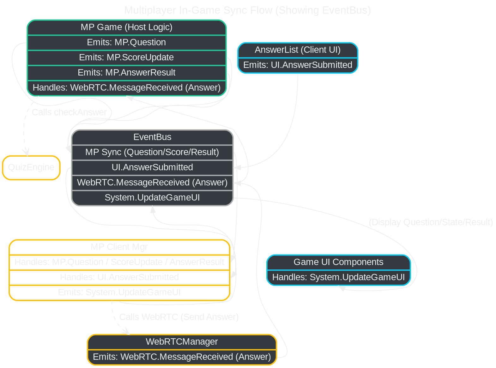

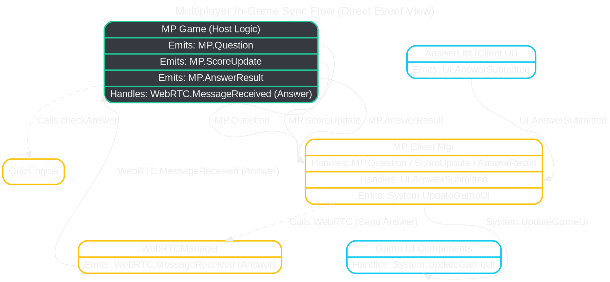

## 7. Scenario: Game End & Highscores

Illustrates the flow when a game finishes (any mode) and highscores are potentially saved and displayed, showing specific events.

```dot
// VERSION: With EventBus
digraph GameEndFlow_WithBus {
    rankdir=TD;
    sep="0.6";
    overlap=false;
    fontname="Arial";
    node [shape=box, style="rounded,filled", fontcolor="#eeeeee", color="#eeeeee", fontname="Arial"];
    graph [label="Game End & Highscore Flow (Showing EventBus)", labelloc=t, fontsize=16];

    // Node Styles (Record for specific event interactions)
    BaseGameMode [shape="record", style="rounded,filled", fillcolor=white, color="#20c997", penwidth=2,
                  label="{ Game Mode (Any) | {<emits_fin> Emits: Game.Finished} }"];
    GameEndDialog [shape="record", style="rounded,filled", fillcolor=white, color="#0dcaf0", penwidth=2,
                   label="{ Game End Dialog UI | {<handles_fin> Handles: Game.Finished} | {<emits_menu> Emits: UI.ReturnToMenu} | {<emits_play> Emits: UI.PlayAgain} }"]; // Specific emits
    HighscoresComponent [shape="record", style="rounded,filled", fillcolor=white, color="#0dcaf0", penwidth=2,
                         label="{ Highscores UI | {<handles_loaded> Handles: Highscores.Loaded} | {<handles_failed> Handles: Highscores.Failed} }"]; // Specific handles
    MainMenuComponent [shape="record", style="rounded,filled", fillcolor=white, color="#0dcaf0", penwidth=2,
                       label="{ MainMenu UI | {<emits_hs> Emits: UI.ShowHighscores} }"];
    GameCoordinator [shape="record", style="rounded,filled", fillcolor=white, color="#e6e0f8", penwidth=2,
                     label="{ GameCoordinator | {<handles_fin> Handles: Game.Finished} | {<handles_play> Handles: UI.PlayAgain} }"];
    UnicornPoep [shape="record", style="rounded,filled", fillcolor=white, color="#e6e0f8", penwidth=2,
                 label="{ App Entry Point | {<handles_menu> Handles: UI.ReturnToMenu} | {<handles_hs> Handles: UI.ShowHighscores} | {<emits_nav> Emits: System.Navigate} }"];
    HighscoreManager [shape="record", style="rounded,filled", fillcolor=white, color="#ffc107", penwidth=2,
                      label="{ HighscoreManager | {<emits_feedback> Emits: System.ShowFeedback} | {<emits_loaded> Emits: Highscores.Loaded} | {<emits_failed> Emits: Highscores.Failed} }"]; // Specific emits
    UIManager [shape="record", style="rounded,filled", fillcolor=white, color="#e6e0f8", penwidth=2,
               label="{ UIManager | {<handles_nav> Handles: System.Navigate} }"];
    ToastComponent [shape="record", style="rounded,filled", fillcolor=white, color="#0dcaf0", penwidth=2,
                    label="{ Toast UI | {<handles_feedback> Handles: System.ShowFeedback} }"];

    // EventBus: Shows specific events for Game End / Highscore flow
    EventBus [shape="record", style="rounded,filled", fillcolor=white, color="#aaaaaa", penwidth=2,
              label="{ EventBus | {<evGameFin> Game.Finished} | {<evReturnMenu> UI.ReturnToMenu} | {<evPlayAgain> UI.PlayAgain} | {<evShowHS> UI.ShowHighscores} | {<evHSLoaded> Highscores.Loaded} | {<evHSFailed> Highscores.Failed} | {<evFeedback> System.ShowFeedback} | {<evNav> System.Navigate} }"]; // Specific ports

    // 1. Game Mode finishes (Event)
    BaseGameMode:emits_fin -> EventBus:evGameFin [label=""];

    // 2. Coordinator and UI react (Events)
    EventBus:evGameFin -> GameCoordinator:handles_fin [label=" (Trigger Save)"];
    EventBus:evGameFin -> GameEndDialog:handles_fin [label=" (Show Dialog)"];

    // 3. Coordinator saves score (if applicable) (Direct Call + Event)
    GameCoordinator -> HighscoreManager [label=" Calls addHighscore()", style=dashed, arrowhead=open];
    HighscoreManager:emits_feedback -> EventBus:evFeedback [label=" (Save Success/Fail)"];
    EventBus:evFeedback -> ToastComponent:handles_feedback [label=""];

    // 4. User action from End Dialog (Specific Events)
    GameEndDialog:emits_menu -> EventBus:evReturnMenu [label=""];
    GameEndDialog:emits_play -> EventBus:evPlayAgain [label=""];

    // 5. App/Coordinator handles dialog action (Specific Events)
    EventBus:evReturnMenu -> UnicornPoep:handles_menu [label=""];
    EventBus:evPlayAgain -> GameCoordinator:handles_play [label=" (Restarts Game Flow)"];

    // 6. User requests highscores from Main Menu (Event + Direct Call + Event)
    MainMenuComponent:emits_hs -> EventBus:evShowHS [label=""];
    EventBus:evShowHS -> UnicornPoep:handles_hs [label=" (Trigger Load)"];
    UnicornPoep -> HighscoreManager [label=" Calls loadScores()", style=dashed, arrowhead=open];
    UnicornPoep:emits_nav -> EventBus:evNav [label=" (to Highscores)"];

    // 7. Highscore Manager loads data (Specific Events)
    HighscoreManager:emits_loaded -> EventBus:evHSLoaded [label=""];
    HighscoreManager:emits_failed -> EventBus:evHSFailed [label=""];

    // 8. Highscore UI displays data / UIManager navigates (Specific Events + Direct Call)
    EventBus:evHSLoaded -> HighscoresComponent:handles_loaded [label=""];
    EventBus:evHSFailed -> HighscoresComponent:handles_failed [label=""];
    EventBus:evNav -> UIManager:handles_nav [label=""];
    UIManager -> HighscoresComponent [label=" Calls show()", style=dashed, arrowhead=open];
}
```

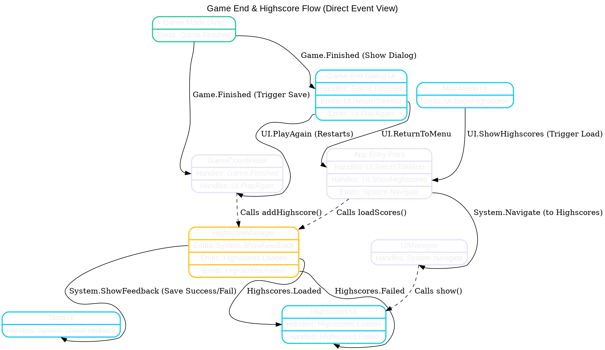

## 8. Scenario: Custom Questions Management (CRUD)

Shows the flow for creating, updating, or deleting custom question sheets, showing specific events.

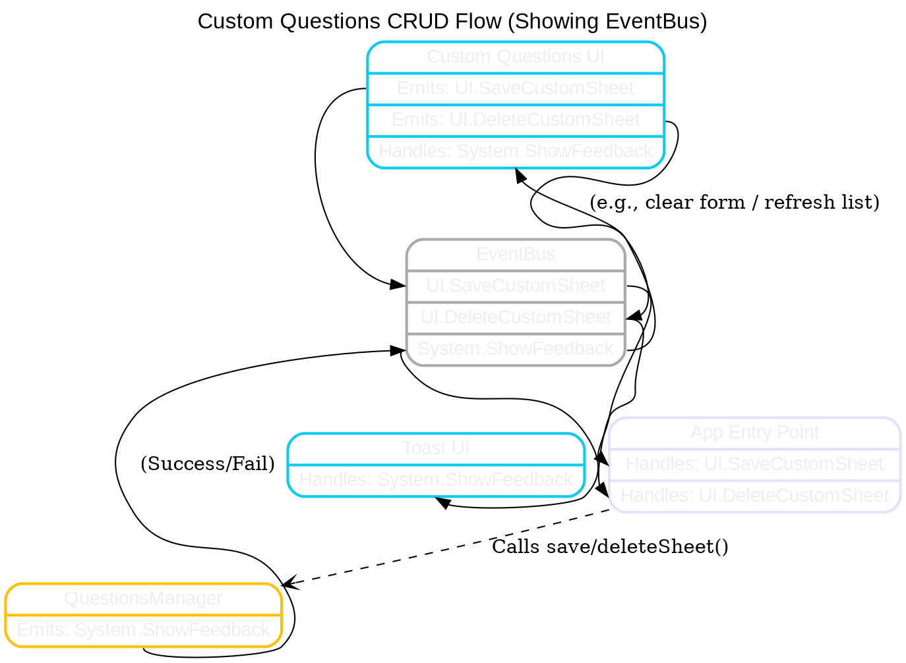

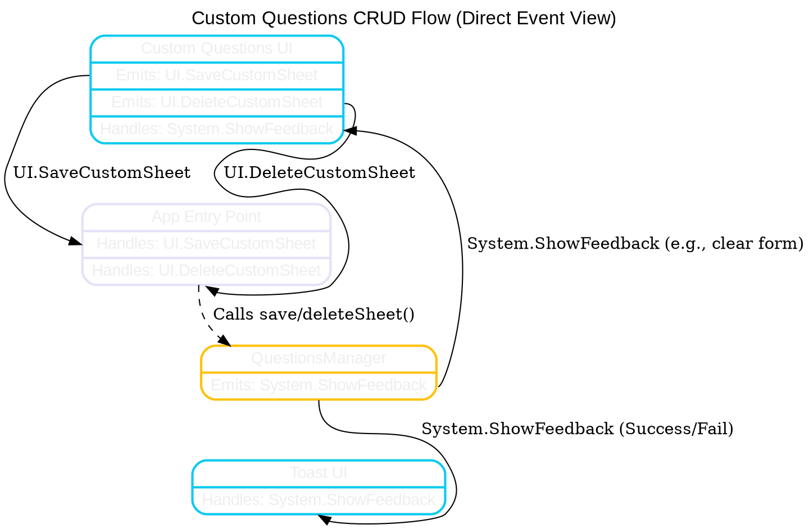